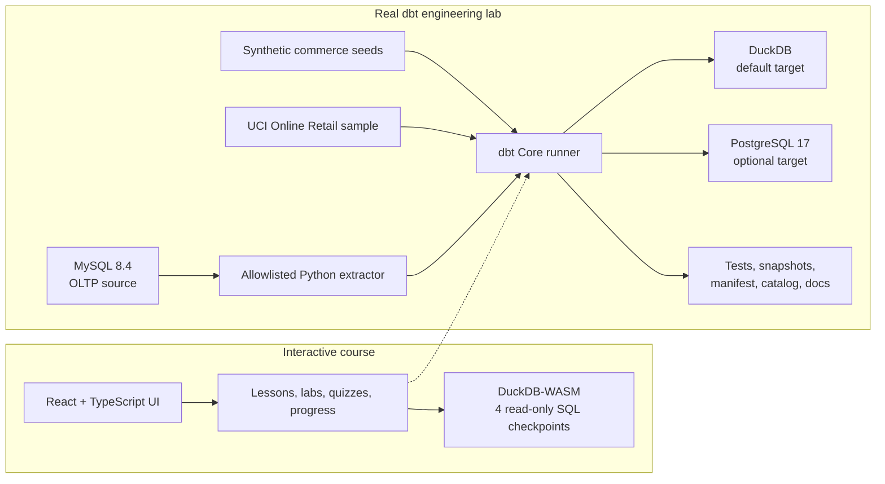

<div align="center">

# DBT Forge

### Learn dbt like a data engineer—not just as templated SQL.

An interactive, local-first course that moves from guided browser lessons to a
real dbt Core project running on DuckDB and PostgreSQL, with MySQL as an
operational extraction source.


[Quick start](#quick-start) · [Curriculum](#curriculum) ·
[Real dbt lab](#real-dbt-lab) · [Capstone](#capstone) ·
[Contributing](#contributing)

</div>

---

## Why DBT Forge?

Most dbt tutorials stop after a few models and tests. DBT Forge follows the
longer engineering path: define grain, protect source contracts, control
fan-out, handle late data, preserve history, publish documentation, and prove
that a project can run against more than one warehouse.

The project combines three learning surfaces:

| Surface | What it teaches | Runtime |
| --- | --- | --- |
| Interactive course | Concepts, worked examples, editable exercises, quizzes, hints, and progress | React + TypeScript |
| Browser SQL checkpoints | Fast, read-only SQL feedback with no server or cloud account | DuckDB-WASM |
| Real engineering lab | dbt parsing, Jinja, DAG execution, tests, snapshots, artifacts, docs, and adapter behavior | Docker + dbt Core |

### At a glance

- **12 modules**, **42 lessons**, and **18 lab-designated lessons**.
- Approximately **24–34 hours** of guided learning and hands-on work.
- Every lesson includes objectives, an explanation, a code example, an
  exercise, three hints, a reference solution, and a four-option knowledge
  check.
- Four focused exercises execute real, read-only SQL in browser DuckDB.
- Advanced exercises route clearly to the full dbt lab instead of simulating
  dbt behavior.
- Progress and quiz scores persist locally in the browser.
- A production-minded ecommerce capstone ties modeling, quality, history,
  documentation, portability, and operations together.

> [!IMPORTANT]
> DuckDB-WASM is a small SQL learning environment, not dbt running in the
> browser. dbt compilation, Jinja, snapshots, artifacts, documentation, and
> adapter-specific behavior run in the containerized lab.

## Quick start

### 1. Run the interactive course

Requirements: Node.js 20+, npm, and a modern browser.

```bash
npm ci
npm run dev
```

Open [http://localhost:4173](http://localhost:4173).

With Make:

```bash
make install
make dev
```

### 2. Run the real dbt lab

Requirements: Docker Engine/Desktop with Compose v2 and Python 3.11+.

```bash
make doctor
make lab-quickstart
```

The quickstart builds the dbt image, installs `dbt_utils`, loads the
deterministic training data, and runs the complete DuckDB project.

Without Make:

```bash
python3 scripts/lab.py doctor
python3 scripts/lab.py quickstart
```

Generate and serve the dbt documentation site:

```bash
make docs
```

Then open [http://localhost:8080](http://localhost:8080). Stop the docs server
with `Ctrl+C`.

## How it works



The browser and dbt projects share the Northstar Shop ecommerce domain and the
same engineering concepts, but intentionally use separate fixtures and
execution boundaries.

## Curriculum

| # | Module | Main engineering focus | Lessons | Labs |
| ---: | --- | --- | ---: | ---: |
| 01 | Warehouse Thinking & dbt Foundations | ELT boundaries, analytics engineering, grain, keys, and a first DuckDB project | 3 | 1 |
| 02 | Projects, Sources & `ref()` | Project anatomy, profiles, sources, selectors, DAGs, and artifacts | 4 | 2 |
| 03 | Staging the Ecommerce Warehouse | Source-aligned staging, types, naming, deduplication, and portability | 4 | 2 |
| 04 | Data Quality as Code | Generic, singular, relationship, threshold, and incident-oriented tests | 4 | 2 |
| 05 | Jinja & Reusable Macros | Compile-time logic, packages, macros, and adapter dispatch | 3 | 1 |
| 06 | Materializations & Physical Design | Views, tables, ephemerals, incrementals, and engine-aware trade-offs | 4 | 2 |
| 07 | Incremental Models at Scale | Idempotency, unique keys, lookback windows, schema evolution, and recovery | 4 | 2 |
| 08 | Snapshots & Slowly Changing Dimensions | Change detection, validity intervals, SCD Type 2, and point-in-time joins | 3 | 1 |
| 09 | Marts, Facts, Dimensions & Metrics | Star schemas, fan-out control, conformed dimensions, and trusted metrics | 3 | 1 |
| 10 | Documentation, Contracts & Lineage | Metadata, contracts, exposures, ownership, and generated docs | 3 | 1 |
| 11 | Production Deployment & CI | Environments, state selection, defer, release gates, and incident recovery | 3 | 1 |
| 12 | Cross-Database Capstone | DuckDB/PostgreSQL portability, MySQL extraction boundaries, and delivery | 4 | 2 |
|  | **Total** |  | **42** | **18** |

For the practical execution order, see
[`lab/course/COURSE.md`](lab/course/COURSE.md). The workbook uses a few extra
operational checkpoints for setup and data provenance while mapping back to the
12 frontend modules.

## Real dbt lab

The lab is a complete dbt project—not a terminal-output mock. It includes:

- Layered staging, intermediate, and mart models.
- Six deterministic relational seed tables.
- Generic, custom generic, relationship, and singular tests.
- A customer snapshot and incremental daily-sales model.
- Macros for source selection, safe division, and revenue logic.
- One exposure plus generated manifest, catalog, and run-result artifacts.
- Six standalone exercise workbooks with starters and solutions.
- DuckDB and PostgreSQL targets.
- A MySQL-to-CSV extraction boundary feeding the DuckDB project.
- Two opt-in models for the public UCI Online Retail data.

Pinned runtime versions live in [`requirements-dbt.txt`](requirements-dbt.txt),
including dbt Core 1.11, `dbt-duckdb`, `dbt-postgres`, and DuckDB.

### Database tracks

| System | Role | Command |
| --- | --- | --- |
| DuckDB | Default analytical warehouse and fastest complete course path | `make dbt-build` |
| PostgreSQL | Optional second dbt target for portability checks | `make services-up`, then `make postgres-build` |
| MySQL | Operational source; six allowlisted tables are extracted before dbt | `make services-up`, then `make mysql-pipeline` |

MySQL is deliberately **not** configured as a dbt target. The course uses it to
teach the ingestion/transformation boundary.

To run dbt from a local virtual environment instead of Docker:

```bash
make lab-setup-local
python3 scripts/lab.py build --local
```

## Course data

DBT Forge separates deterministic training fixtures from observed public data.

### Synthetic commerce warehouse

The default dbt lab contains 361 deterministic synthetic rows across six
related tables:

| Table | Rows | Grain |
| --- | ---: | --- |
| `customers` | 16 | One row per customer |
| `products` | 12 | One row per product |
| `orders` | 72 | One row per order |
| `order_items` | 183 | One row per order line |
| `payments` | 72 | One row per payment |
| `returns` | 6 | One row per return |

These are clearly labeled synthetic fixtures and can be regenerated with:

```bash
make synthetic
```

The browser course has a separate, deliberately imperfect fixture for guided
cleanup and validation exercises.

### Real public sample

The repository includes a deterministic **750-row** sample from Daqing Chen's
[UCI Online Retail dataset](https://archive.ics.uci.edu/dataset/352/online-retail),
licensed **CC BY 4.0**.

Build its opt-in DuckDB models without downloading anything:

```bash
make uci-sample
```

To download, convert, record provenance for, and model the complete upstream
dataset:

```bash
make uci-import
make uci-build
```

The full import requires internet access and writes large files to a
git-ignored directory. See [`data/README.md`](data/README.md) for the DOI,
license, transformation details, and redistribution guidance.

## Capstone

The final project is a **Commerce Reliability Data Product**. Learners must
deliver a source-to-mart DAG that works in DuckDB and PostgreSQL and can defend
its business logic and operational behavior.

Required evidence includes:

- Explicit fact and dimension grain.
- Reconciled revenue by currency without fan-out.
- Structural, referential, domain, and business-rule tests.
- A safe incremental strategy for late-arriving data.
- One justified historical snapshot.
- Model and column documentation, ownership, and lineage.
- A repeatable runbook for setup, failure triage, backfill, and recovery.

Read the complete brief and rubric in
[`lab/course/CAPSTONE.md`](lab/course/CAPSTONE.md).

## Command reference

Run `make help` for the complete list.

| Goal | Command |
| --- | --- |
| Start the course UI | `make dev` |
| Run frontend validation, tests, build, and Compose validation | `make verify` |
| Build the complete DuckDB lab | `make lab-quickstart` |
| Build a focused dbt subgraph | `make dbt-build SELECT=stg_orders+` |
| Run dbt tests | `make dbt-test` |
| Generate and serve dbt docs | `make docs` |
| Start PostgreSQL and MySQL | `make services-up` |
| Run the PostgreSQL target | `make postgres-build` |
| Run MySQL load → extract → DuckDB | `make mysql-pipeline` |
| Build the bundled real-data sample | `make uci-sample` |
| Stop service containers | `make services-down` |
| Remove dbt artifacts and the DuckDB file | `make clean` |

`make services-down` keeps the named PostgreSQL and MySQL volumes. To remove
those local training databases too, run `docker compose down --volumes`.

### Local ports

| Service | URL / port |
| --- | --- |
| Course frontend | `http://localhost:4173` |
| dbt documentation | `http://localhost:8080` |
| PostgreSQL host port | `5433` |
| MySQL host port | `3307` |

The database usernames and passwords in `docker-compose.yml` are disposable
local training credentials. Do not reuse them outside this lab.

## Project structure

```text
dbt-course/
├── src/                     # React course, curriculum, browser runner, tests
├── lab/
│   ├── models/              # Staging, intermediate, marts, optional UCI models
│   ├── macros/              # Reusable SQL and custom tests
│   ├── seeds/               # Deterministic synthetic commerce data
│   ├── snapshots/           # Historical customer state
│   ├── tests/               # Singular business assertions
│   ├── exercises/           # Standalone practical assignments
│   ├── starters/            # Incomplete exercise files
│   ├── solutions/           # Reference implementations
│   └── course/              # Lab path and capstone rubric
├── data/                    # Provenance, real sample, and MySQL initialization
├── scripts/                 # Allowlisted lab runner and data pipelines
├── Makefile                 # Unified developer and learner commands
├── Dockerfile.dbt           # Pinned Python/dbt environment
├── docker-compose.yml       # dbt runner, PostgreSQL, and MySQL services
└── package.json             # Frontend dependencies and scripts
```

## Verification

Frontend-only checks:

```bash
npm run lint
npm test
npm run build
```

Full repository gate, including Docker Compose configuration validation:

```bash
make verify
```

Real dbt smoke test:

```bash
make lab-quickstart
make dbt-build
```

`npm run lint` performs TypeScript validation. This repository does not yet
include a hosted deployment or GitHub Actions workflow, so local verification
is the current source of truth.

## Contributing

Contributions are welcome when they keep the course reproducible and honest.

1. Keep lesson objectives, exercises, hints, solutions, and quizzes aligned.
2. Run `make verify` for frontend or curriculum changes.
3. Run `make lab-quickstart` for dbt model, macro, test, or seed changes.
4. Preserve the distinction between synthetic fixtures and public observed data.
5. Add source, license, retrieval, and transformation notes for every new
   external dataset.
6. Never commit private customer data, real credentials, generated warehouses,
   dbt targets, logs, or downloaded full datasets.

The command runner in [`scripts/lab.py`](scripts/lab.py) uses allowlisted
operations and invokes subprocesses without arbitrary shell interpolation. Keep
new automation inside that model.

## Licensing and attribution

A project-wide software license has not yet been added. Do not assume permission
to reuse the source code until the repository owner selects one.

Dataset licensing is separate: the bundled UCI Online Retail sample is licensed
under CC BY 4.0 and must retain its attribution. The synthetic course fixtures
are generated locally and documented in
[`data/SYNTHETIC_DATA.md`](data/SYNTHETIC_DATA.md).

